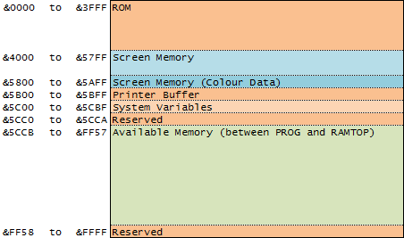
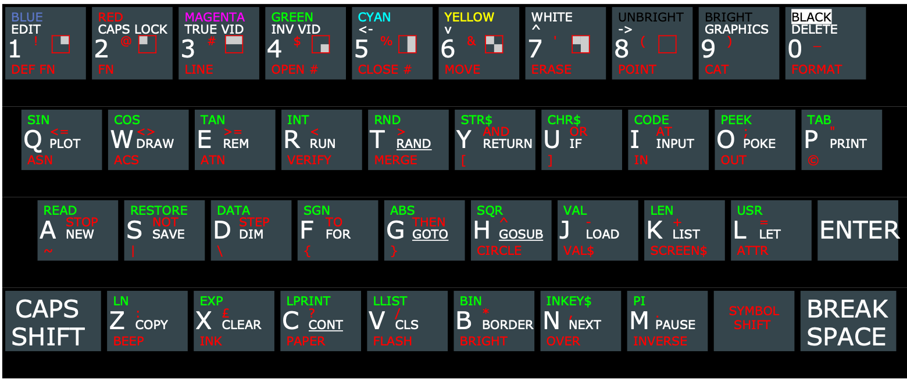
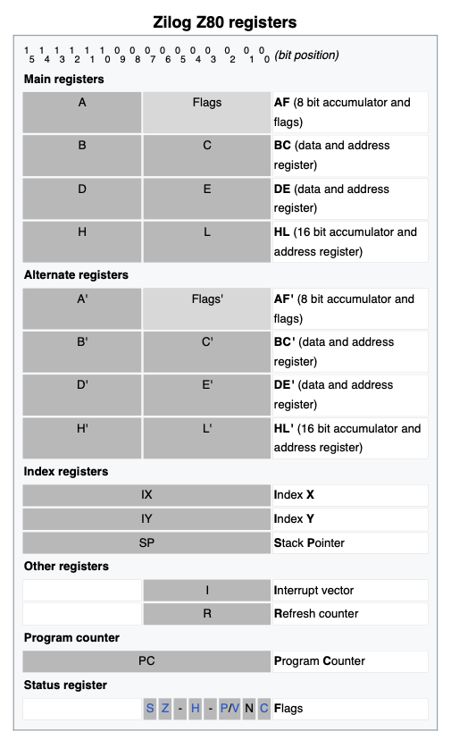
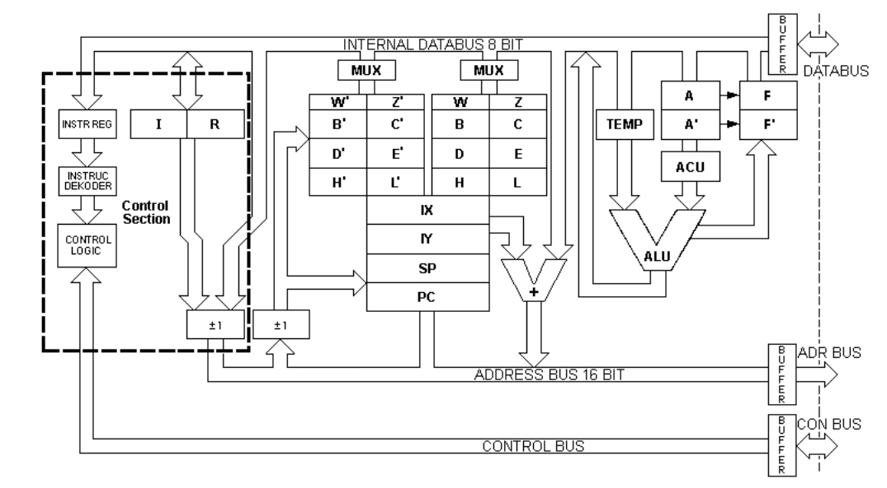

# Tools

Useful templates, tools and diagrams to assist in the study of Z80 Assembly.

## 🗂️ Table of Contents
* 🧬 [Templates](#Templates)
* ⚒️ [Tools](#Tools)
	* 🐚 [Shell 1-liners](#ShellOneLiners)
	* 🚏 [Useful ROM Routines](#ROMRoutines)
* 📈 [Diagrams](#Diagrams)
	* 🧠 [Memory Map](#MemoryMap)
	* ⌨️ [ZX Spectrum Keyboard Layout](#ZXSpectrumKeyboardLayout)
	* 📝 [Registers](#Registers)
	* 🏛️ [Basic Architecture](#BasicArchitecture)

<a name="Templates"></a>
##🧬 Templates

* [make](./make/README.md) - the [Makefile](https://www.gnu.org/software/make/manual/make.html#Introduction) template I'm using to build, convert and run the `asm` code

<a name="Tools"></a>
## ⚒️ Tools

<a name="ShellOneLiners"></a>
### 🐚 Shell 1-liners

Simple and useful shell commands.

#### Convert DEC > HEX

You can use one of the following syntaxes to convert a decimal value into an hexadecimal one.

* `printf "%x\n" <dec-number>`
* `echo $(([##16]<dec-number>)`

Examples:

```
$ printf "%X\n" 43981
ABCD

$ echo $(([##16]43981))
ABCD

```

#### Convert HEX > DEC

You can use one of the following syntaxes to convert an hexadecimal value into a decimal one:

* `printf "%d\n" <hex-number>`
* `echo $((16#<hex-number>))`

Example:

```
$ printf "%d\n" 0xABCD
43981

$ echo $((16#FF))
255

```

<a name="ROMRoutines"></a>
### 🚏 Useful ROM routines

A selected list of useful ROM routines. 

| Address     | Type | Description | Arguments | Comments |
| ----------- | ---- | ----------- | --------- | -------- |
| 5633 (0x1601) | I/O | Configures the top of the screen | **A:** the number of the line to be considered the top of the scren | TCSRDp66 |

`TCSRD p<num>` refers to the [The Complete Spectrum ROM Disassembly](https://spectrumcomputing.co.uk/entry/2000076/Book/The_Complete_Spectrum_ROM_Disassembly) page.

<a name="Diagrams"></a>
## 📈 Diagrams

In the most appropriate order for me to consult.

<a name="MemoryMap"></a>
### 🧠 Memory Map

**48K ZX Spectrum** memory map



*(Credit: [L Break Into Program, 0:1](http://www.breakintoprogram.co.uk/hardware/computers/zx-spectrum/memory-map))*

<a name="ZXSpectrumKeyboardLayout"></a>
### ⌨️ ZX Spectrum Keyboard Layout



*(Credit: [slady](http://slady.net/Sinclair-ZX-Spectrum-keyboard/layout/))*

<a name="Registers"></a>
### 📝 Registers



*(Credit: [Wikipedia](https://en.wikipedia.org/wiki/Zilog_Z80#Registers))*

<a name="BasicArchitecture"></a>
### 🏛️ Basic Architecture



*(Credit: [Z80 info](http://www.z80.info/z80arki.htm))*

