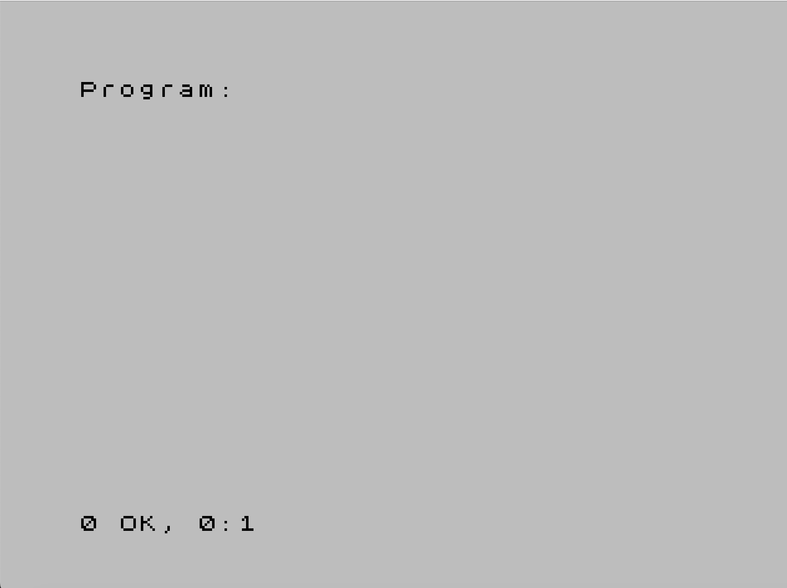
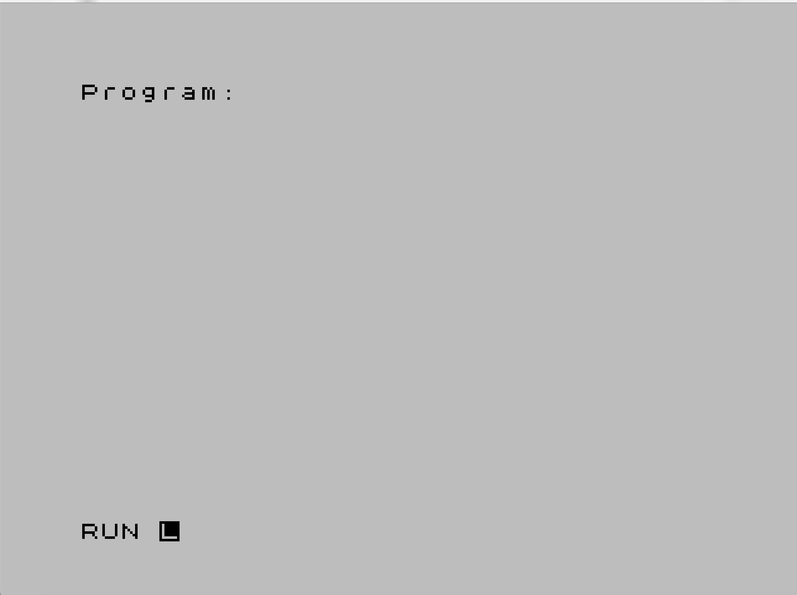

# Makefile

The [Makefile](https://www.gnu.org/software/make/manual/make.html#Introduction) template I'm using to build, convert and run the `bas` code.

The script can be easily modified to adapt for projects particular specifications or needs. To alter it consult the [Script](#Script) section.

## Table of Contents
* 🎯 [Targets](#Targets)
* 📋 [Assumptions](#Assumptions)
* ▶️ [Usage](#Usage)
* 📜 [Script](#Script)

<a name="Targets"></a>
## 🎯 Targets

This are the supported targets:

* `clean` - cleans the output (`.tap`) files 
* `housekeeping` - checks and creates the necessary structure to support project building and running
* `tape` - translates the object (`.bas`) file to the [TAP format](https://sinclair.wiki.zxnet.co.uk/wiki/TAP_format) (`.tap`)
* `run` - runs the (`.tap`) file in the ZX Spectrum Emulator
* `all` - cleans, builds, converts to TAP and runs the code

<a name="Assumptions"></a>
## 📋 Assumptions

For this Makefile to work, it is expected that `bas2tap` is in the `$PATH`. If it's not in the `$PATH`, you may need to install it or provide the full path to this tool in the Makefile.

<a name="Usage"></a>
## ▶️ Usage

### 🏗️ Set up

Setting up the `Makefile` for your project is straightforward. Follow these steps:

1. **Copy the `Makefile`**: Begin by copying the provided `Makefile` to your project folder
2. **Configure `FILENAME`**: Open the `Makefile` and locate the `FILENAME` variable at the top. Update it with the name of your assembly source code file. Importantly, **do not include the `.bas` extension**, and **make sure there are no spaces after the file name**. Failing to do so might cause issues with the script
3. **Write Your BASIC Code**: Create your `.bas` source file and write your BASIC code in it

With these steps, you'll have your assembly project ready to go.

### 🔄 Executing

1. Call the `Makefile` with the desired target. You may omit the target to execute `all`

Example:

```
$  make
```

This will clean, convert to [TAP](https://sinclair.wiki.zxnet.co.uk/wiki/TAP_format) format, and load the code to the emulator.

Once in the emulator you need to explicitly run the code that has been stored in memory. You should see something similar to the following:



To execute the code you need to use the `RUN` command in the prompt:



You can use `Ctrl+C` to stop the emulator when running from the command line.

Examples of other targets:

```
$ make clean
$ make housekeeping
$ make tape
$ make run
```
 
 <a name="Script"></a>
## 📜 Script

This section provides a detailed explanation of the Makefile.

The `Makefile` is designed to be easily reused and maintainable. A single edit is needed in the script to have it working for a new simple project. A simple project, in this context, should be understood as a single assembly file for educational purposes.

### Variable Setting

The script consists of two main parts:

#### 1. Variable Setting

The first variable to be defined is `FILENAME`. This should be set by the user with the name of the file that will contain the assembly source code. **Do not include the extension here**, even if the filename contains it. This variable is used to generate other variables automatically:

- `SOURCE` - the full name of the assembly source code file, including the extension
- `OUT` - the output file that contains the binary data in the [TAP](https://sinclair.wiki.zxnet.co.uk/wiki/TAP_format) format.

Then, another variable, `OUT_DIR` is set. This defines a path for the build products so that it can be easily skipped using `.gitignore`.

#### 2. Tools and Flags

The next set of variables relates to the tools of the chain and their flags:

- `TAP` - defines the tool for converting binary machine code files into [TAP](https://sinclair.wiki.zxnet.co.uk/wiki/TAP_format) format. `bas2tap` is used here.
- `FUSE` - defines the full path of `Fuse`. To avoid adding `/Applications` to the `$PATH`, the full path is specified.
- `FUSE_FLAGS` - defines the flags to pass to `Fuse`:
  - `--tape` - allows the name of the TAP file to be passed as an argument from the command line.

### Targets

This section provides an overview of the defined targets in the script. As explained in the [Targets](#Targets) section, these targets are created based on the variables defined earlier. Each target includes a "silent echo" (`@echo`) directive to provide informative output to the user during target execution.

The targets are set up using `Makefile` [prerequisites](https://www.gnu.org/software/make/manual/html_node/Rules.html) as follows:

- `all`: This target depends on both `clean` and `run`. It serves as a high-level target that ensures cleaning before running the code

- `run`: This target depends on `tape`, ensuring the presence of the necessary TAP file for emulator execution

- `tape`: This target depends on `housekeeping` to establish the necessary project structure, ensuring that there is a BASIC code file available to be translated into the [TAP format](https://sinclair.wiki.zxnet.co.uk/wiki/TAP_format)

- `clean` and `housekeeping`: These targets do not depend on any other targets and serve independent purposes in managing the project

The dependency structure among these targets ensures a smooth workflow for  generating TAP files, cleaning up, and running the code in an emulator making sure that the steps have their needed upstream dependencies in place before execution therefore minimizing errors. 
